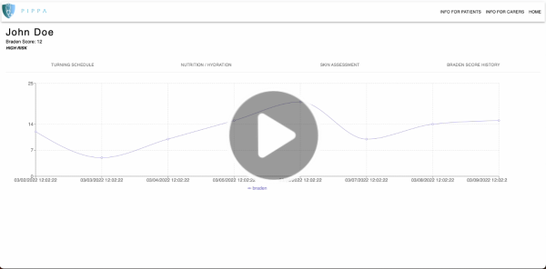

# 2022 Hackathon - PIPPA (Group 2)

### Members: 
Tahsin Chowdhury 
Brandon Attai 
Behnaz Sheikhi 
Kelten Falez 
Daud Sheikh 

## Deployed link:  
http://pippa-application.herokuapp.com/

### Login details for deployed link:  
Username: admin
 Password: password 

## Demo Video:  

